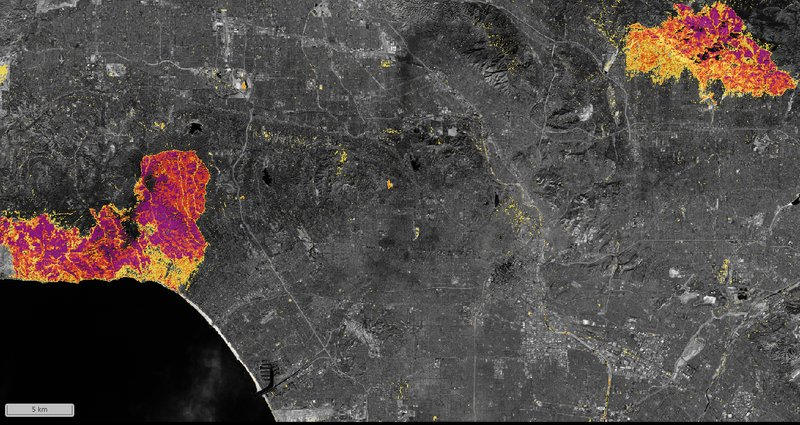
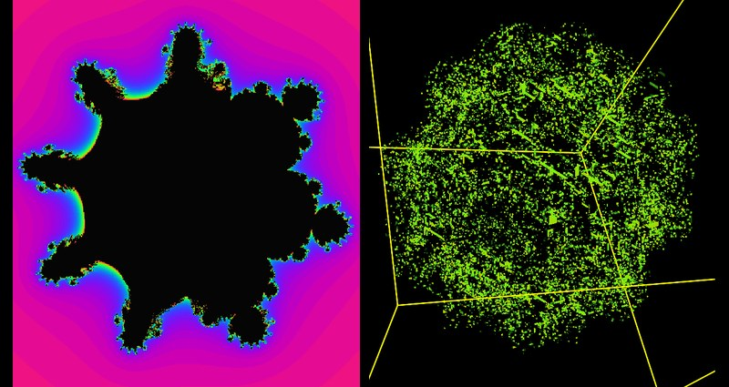
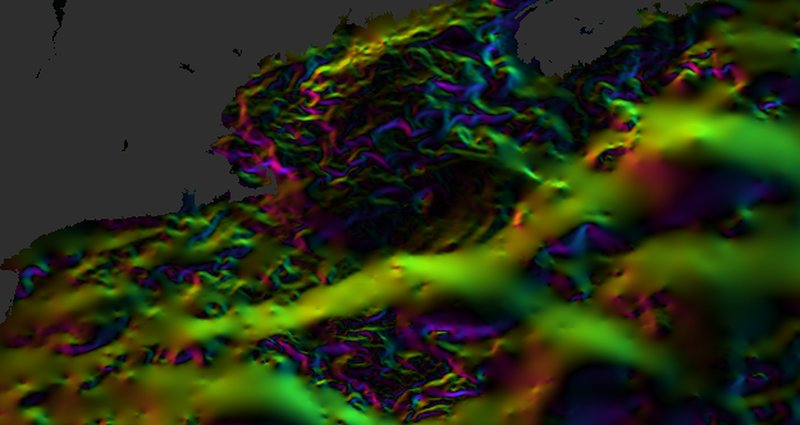

# chunkmirage

**Spoof chunked array formats over HTTP with on-the-fly processing.**

**▶ [Try the demos in your browser](https://yuriyzubov.github.io/chunkmirage/browser/)**,
nothing to install. Every chunk on screen is computed in the page by chunkmirage's own
Python, from public data, as the viewer asks for it.

<p>
<a href="https://yuriyzubov.github.io/chunkmirage/browser/pipeline.html?card=fires"></a>
<a href="https://yuriyzubov.github.io/chunkmirage/browser/pipeline.html?card=mandelbulb"></a>
<a href="https://yuriyzubov.github.io/chunkmirage/browser/pipeline.html?card=fronts"></a>
</p>

They include burn severity of the Los Angeles fires, the Gulf Stream's fronts and
hurricanes' cold wakes, landing slopes at the Moon's south pole, a 3-D fractal, microscope
tiles stitched by RANSAC, two fly brains registered on your GPU, organelle contact sites,
mRNA spots and nuclei tracked through a colony. Each shows the `chunkmirage serve` command
that serves the same from Python. The [demos page](docs/demos.md) lists them all, with the
Python examples.

chunkmirage serves *virtual* datasets that look, to any HTTP-capable viewer or library
(Neuroglancer, BigDataViewer/Fiji, vizarr, napari, webKnossos, zarr-python, dask,
tensorstore, ...), like ordinary Zarr v2, Zarr v3, N5 or Neuroglancer precomputed volumes.
Nothing exists on disk. Each chunk is computed when it is requested: read from a real
source (zarr, N5, precomputed, HDF5, GeoTIFF; local, S3, GCS or HTTP) or generated, pushed
through a pipeline of ops, encoded in the format the client asked for, and cached per
stage, so changing a parameter downstream never recomputes what comes before it.

```
viewer  --HTTP-->  chunkmirage  --tensorstore/h5py-->  real data (zarr/n5/precomputed/hdf5, file/s3/gcs/http)
                      |
                      +-- pipeline: source -> [op, op, ...] -> encoded chunk
                      +-- per-stage chunk cache keyed by pipeline hash
                      +-- frontends: n5 | zarr (v2) | zarr3 | precomputed, all served at once
                      +-- REST API for live pipeline edits, and plugins for ops, sources and routes
```

It was inspired by [example-virtual-n5](https://github.com/stuarteberg/example-virtual-n5)
and [cellmap-flow](https://github.com/janelia-cellmap/cellmap-flow), which grew out of it,
and makes their trick general: any format, any source, any per-chunk computation, any
client.

## Quick start

```bash
uv sync --extra all --group dev            # or: pip install -e ".[all]"
chunkmirage serve /path/to/data.zarr/em/fibsem-uint8 --op threshold:low=120
```

With no data at all, a generated 4096³ volume, segmented live:

```bash
uv run chunkmirage serve "synthetic://blobs+noise?shape=4096,4096,4096" \
    --op gaussian:sigma=1.5 --op threshold:low=110 \
    --op morphology:operation=open,radius=2 --op label:min_size=200 --python-viewer
```

Open the printed control page (`http://<your-ip>:8000/ui`) and drag the `threshold` slider:
only the changed stage recomputes. Or point any viewer at one of these:

| viewer source URL                                        | format                   |
| -------------------------------------------------------- | ------------------------ |
| `n5://http://localhost:8000/<name>/n5`                   | N5                       |
| `zarr://http://localhost:8000/<name>/zarr`               | Zarr v2 (+ OME-NGFF 0.4) |
| `zarr3://http://localhost:8000/<name>/zarr3`             | Zarr v3 (+ OME-NGFF 0.5) |
| `precomputed://http://localhost:8000/<name>/precomputed` | Neuroglancer precomputed |

Edit the pipeline without restarting:

```bash
curl -X PUT localhost:8000/api/datasets/<name> -H 'content-type: application/json' \
  -d '{"source": "/path/to/data.zarr/em/fibsem-uint8", "ops": [{"op": "threshold", "low": 150}]}'
```

More in [getting started](docs/getting-started.md), including viewing from another machine.

## As a library

```python
from chunkmirage import Pipeline, open_source, create_app
from chunkmirage.ops import Op, Threshold

class MyModel(Op):
    name = "my_model"
    halo = 16          # voxels of context read on every side
    cache = True       # keep this stage's output chunks

    def apply(self, block):
        return run_my_network(block)

pipe = Pipeline(open_source("s3://bucket/data.zarr/em/s0"), ops=[MyModel(), Threshold(low=120)])
app = create_app({"em": pipe})                   # a Starlette ASGI app
```

Ops, source schemes and HTTP routes from other packages register through entry points
(`chunkmirage.ops`, `chunkmirage.sources`, `chunkmirage.routes`), and the app can be mounted
inside another one. See [pipelines](docs/concepts/pipelines.md) and the
[REST API](docs/reference/api.md).

## What it does today

* **Sources:** zarr v2/v3, N5, precomputed and HDF5 on file, S3, GCS or HTTP; xarray arrays
  and GeoTIFFs; computed `synthetic://` volumes, `scene://` resampling through OME-Zarr 0.6
  transformations, `register://` deformable registration solved on a GPU, `stitch://`
  BigStitcher tiles stitched and fused as read, and `warp://`, `stack://` and `flip://`.
* **Frontends:** N5, Zarr v2, Zarr v3 and precomputed, all at once, and meshes made when
  fetched.
* **Ops:** pointwise, filters, morphology, connected components, spots, contacts,
  downsampling, slope and hillshade, with halos handled for you.
* **Serving:** per-stage cache, live REST edits, a control page, work ordered by what clients
  ask for and dropped when they stop waiting.
* **In the browser:** the same ops run in Pyodide, and registration on WebGPU.

Not yet: GPU ops other than registration, an MCP server. See the [roadmap](docs/roadmap.md).

## Documentation

**https://yuriyzubov.github.io/chunkmirage/** (built from `docs/`; `uv run mkdocs serve`
locally). [docs/design.md](docs/design.md) explains the architecture and the choices behind
it.

## License

BSD 3-Clause, Howard Hughes Medical Institute. Authors: TBD (collaborative project).
